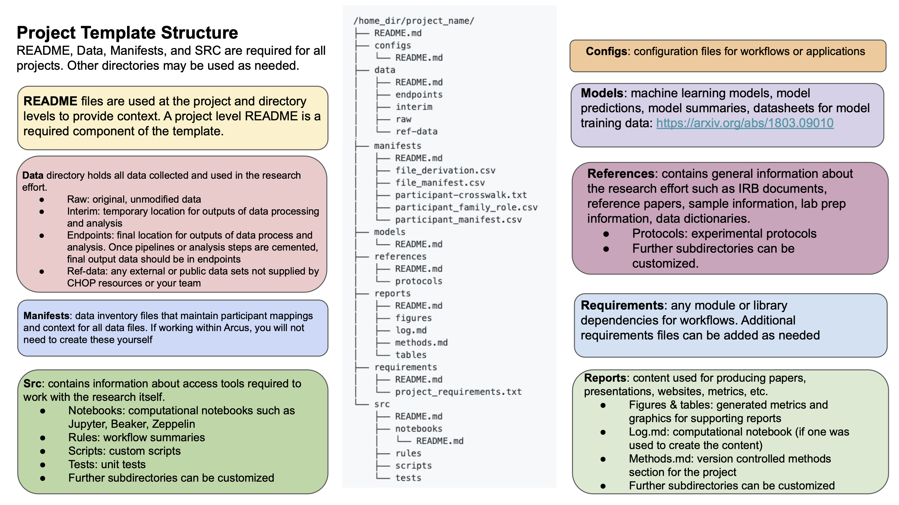

# Arcus Project Template

## Overview
This template was developed by the Library Science Team in Arcus at Children's Hospital of Philadelphia. It is used for archiving and managing reproducible biomedical research data. To learn more about the Arcus project, [visit the project page](https://www.research.chop.edu/applications/arcus).

The project template is designed to be adaptable and iterative to capture the wide range of biomedical research activities. The project template combines flexibility to encompass diverse data capturing needs, while also maintaining a consist structure for all archived data which facilitates seamless communication among various projects spanning different domains, thereby promoting effective data sharing.

**How was this structure developed?**

The CHOP project template file directory structure was adapted from [DrivenData’s Cookiecutter Data Science template](https://cookiecutter.readthedocs.io/en/stable/). It was adapted by former Arcus Digital Archivist, Christiana Dobrzynski, and former CHOP Bioinformatician, Perry Evans. Both Arcus’s and DrivenData’s templates aim to organize research data and tools for accuracy and reproducibility. See DataDriven's introduction to learn more about the goals and purpose of project template structures for data preservation and sharing.

The CHOP project template evolved through iterations and feedback from CHOP researchers. A multi-disciplinary groups of practitioners were consulted in the template adaptation development, including:
* Bioinformatics

* Cancer research

* Microbiome center

* Research IT

* Clinical sequencing unit

* Medical Informatics Unit

## Using this template

This repository shows a skeleton for organizing a biomedical research project. Each directory has a README.md that describes the type of information that should be saved in each section. These sections are 'bins' for the different areas of data and files that are outputted for most research projects. Each project will likely have further sub-directories within the template to organize and describe information.

To learn more about how this project template can be used for managing research data, see our [Project Template module](https://liascript.github.io/course/?https://raw.githubusercontent.com/arcus/Arcus_Labs_Orientation/main/data_contribution_2_data.md#6).

To use this template, you can clone this repository and then use it for your project. For directions for cloning a template, please see the [GitHub documentation](https://docs.github.com/en/repositories/creating-and-managing-repositories/cloning-a-repository).

## Project Template structure

As the Project Template Directory is built to be applied across different biomedical research projects, you should only use the directories that relate to your data. The only components that are required for every project are:

* parent folders
    * data/
        * raw/ 
    * manifests/ 
        * *file_manifest.csv*
        * *participant_manifest.csv*
        * *participant-crosswalk.txt*
    * src/ 
* README
    * for overall project
    * all folders used

## Project Template required practices

The Project Template should be applied in tandem with good data practices, such as:
* version control
* standardized naming conventions
    * file names
    * folder names
    * project name
* retention
    * regular review of contents and files for long-term use/preservation and for deletion

## Contact

If you have any questions about this repository or the Project Template, please reach out to the Library Science team at: dlarcuslibraryscience@chop.edu
